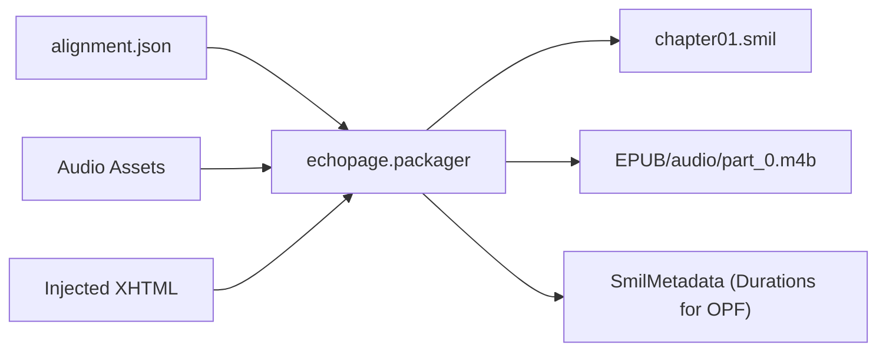

# EPUB 3 Media Overlays: SMIL 3.0 Generation

This document details the design, architecture, and usage of the SMIL 3.0 generation subsystem (`echopage.packager`) within EchoPage.

---

## 1. Overview & Architecture

In EPUB 3 Media Overlays, SMIL (Synchronized Multimedia Integration Language) documents act as the **playback playlist** for each chapter. The SMIL document synchronizes the visual text with recorded audio narration by defining a sequence of parallel items (`<par>`), where each `<par>` pairs an XHTML element (identified by its `#fragment_id`) with a corresponding segment of audio defined by its begin and end clip times (`clipBegin` and `clipEnd`).



---

## 2. SMIL 3.0 XML Structure

SMIL Media Overlays files adhere to the W3C SMIL 3.0 and EPUB 3 Media Overlays 3.0 specifications.

### XML Schema Template

```xml
<?xml version="1.0" encoding="UTF-8"?>
<smil xmlns="http://www.w3.org/ns/SMIL" xmlns:epub="http://www.idpf.org/2007/ops" version="3.0">
  <body>
    <seq id="seq_chapter01" epub:textref="chapter01.xhtml" epub:type="chapter">
      <par id="par_0001">
        <text src="chapter01.xhtml#mo_s_0001"/>
        <audio src="audio/part_0.m4b" clipBegin="0.031s" clipEnd="2.014s"/>
      </par>
      <par id="par_0002">
        <text src="chapter01.xhtml#mo_s_0002"/>
        <audio src="audio/part_0.m4b" clipBegin="2.295s" clipEnd="5.360s"/>
      </par>
    </seq>
  </body>
</smil>
```

### Key Elements & Attributes

| Element / Attribute | Description |
|---|---|
| `<smil>` | Root element. Declares default namespace `xmlns="http://www.w3.org/ns/SMIL"` and `xmlns:epub="http://www.idpf.org/2007/ops"`. Attribute `version="3.0"`. |
| `<body>` | Top-level container within `<smil>`. |
| `<seq>` | Sequence container. Contains `id` (e.g. `seq_chapter01`), `epub:textref` (relative URI to chapter XHTML), and `epub:type="chapter"`. |
| `<par>` | Parallel playback container. Each `<par>` has a unique identifier within the document (e.g. `par_0001`, `par_0002`, ...). |
| `<text src="...#id"/>` | Pointer to the text segment. Uses relative URI from the SMIL file to the XHTML file, plus fragment identifier `#mo_s_xxxx`. |
| `<audio src="..." clipBegin="..." clipEnd="..."/>` | Pointer to the audio asset. Uses relative URI from the SMIL file to the audio file within the EPUB container. Clip times are formatted as seconds with 3 decimals (`N.NNNs`). |

---

## 3. Clock Formatting & Parsing

SMIL clock values must be specified in seconds with the `s` metric suffix and 3 decimal places:

- `2340 ms` &rarr; `2.340s`
- `31 ms` &rarr; `0.031s`
- `0 ms` &rarr; `0.000s`

In addition, OPF manifest metadata (Task 12) requires duration formatted as `HH:MM:SS.mmm`:

- `3723456 ms` &rarr; `01:02:03.456`

### Clock Utilities

```python
from echopage.packager import format_smil_clock, parse_smil_clock, format_clock_hms

# Milliseconds to SMIL clock
format_smil_clock(2340)  # "2.340s"

# Parse clock string to seconds
parse_smil_clock("2.340s")  # 2.34

# Milliseconds to OPF duration clock
format_clock_hms(3723456)  # "01:02:03.456"
```

---

## 4. `SmilDuration` and `SmilMetadata` Data Structures

To satisfy the contract that the per-SMIL duration returned equals the last `clipEnd` while remaining seamlessly compatible with downstream OPF metadata generation, EchoPage defines `SmilDuration(float)`:

- **Float compatibility**: Subclasses `float`, so it can be compared with numeric floats (`dur == 23.732`) or summed directly (`sum(...)`).
- **Clock string equality**: Overloads `__eq__` so `dur == "23.732s"` is `True`.
- **Properties**: Provides `.ms` (integer milliseconds), `.clock` (`N.NNNs`), and `.hms` (`HH:MM:SS.mmm`).

```python
from echopage.packager import SmilDuration

dur = SmilDuration(23.732, 23732)
dur == 23.732       # True
dur == "23.732s"    # True
dur.ms              # 23732
dur.clock           # "23.732s"
dur.hms             # "00:00:23.732"
```

The `SmilMetadata` dataclass contains:

```python
@dataclass
class SmilMetadata:
    smil_path: Path
    chapter_id: str
    duration: SmilDuration
    duration_ms: int
    duration_s: float
    duration_clock: str
    audio_src: str
    audio_file_path: Path | None = None
    par_count: int = 0
    xhtml_path: Path | None = None
```

---

## 5. Audio File Placement & Relative Paths

EPUB 3 Media Overlays require audio files to reside inside the EPUB container archive.

1. **Content Directory Discovery**: `find_epub_content_dir(work_dir)` parses `META-INF/container.xml` to discover the OPF directory (e.g. `EPUB/` or `OEBPS/`).
2. **Audio Destination**: Chapter audio files are copied into `<content_dir>/audio/<audio_filename>`.
3. **Relative Path Resolution**:
   - `rel_xhtml = os.path.relpath(xhtml_path, smil_path.parent)`
   - `rel_audio = os.path.relpath(dest_audio_path, smil_path.parent)`
   This ensures valid relative references regardless of whether files are organized in a flat structure (`EPUB/chapter01.smil`, `EPUB/chapter01.xhtml`, `EPUB/audio/part_0.m4b`) or nested subdirectories (`EPUB/smil/`, `EPUB/text/`, `EPUB/audio/`).

---

## 6. XHTML ID Validation

Before generating each SMIL document, `generate_chapter_smil` parses the destination XHTML file with `lxml.etree` and extracts all existing XML IDs (`root.xpath("//@id")`).

If a timeline entry references an `#element_id` that is not present in the XHTML file, a `SmilGenerationError` is raised with a descriptive error message. This prevents broken fragment links from ever being written into the book.

---

## 7. Python API & CLI Usage

### Python API

```python
from echopage.packager import inject_alignment_spans, generate_smil_playlists

# 1. Inject span IDs into unpacked EPUB XHTML files
inject_alignment_spans(work_dir="unpacked_epub", alignment="alignment.json")

# 2. Generate SMIL playlists and copy audio files
smil_results = generate_smil_playlists(
    work_dir="unpacked_epub",
    alignment="alignment.json",
    audio_source="audio_folder",
)

for spine_id, meta in smil_results.items():
    print(f"Chapter '{spine_id}': {meta.smil_path} (Duration: {meta.duration_clock})")
```

### CLI Command

```bash
echopage generate-smil <work_dir> <alignment_json> [--audio <audio_source>]
```

Example:
```bash
echopage generate-smil unpacked_book alignment.json --audio audio_parts/
```
Output:
```
Generated SMIL playlists for 2 chapters:
  - chapter01: chapter01.smil (23.732s, 8 clips)
  - chapter02: chapter02.smil (21.338s, 5 clips)
```
